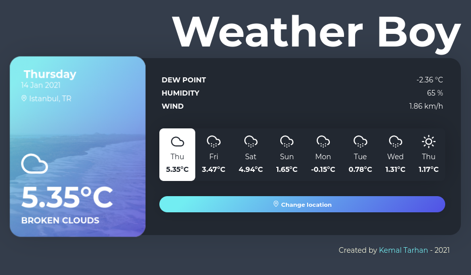

# Weather Boy with React
[](https://app.netlify.com/sites/kodluyoruz-kemal-tarhan-weather-boy/deploys)



Weather app built using;
- React Context
- [OpenWeatherMap API](https://openweathermap.org/) - Weather Data /w 7 Day Forecast
- [OpenCageData API](https://opencagedata.com/) for Location Names

Special thanks for design - [Colin Espinas](https://codepen.io/Call_in)

You need to set this in .env file;
```
REACT_APP_LOCATION_DATA_URL
REACT_APP_WEATHER_DATA_URL
```

